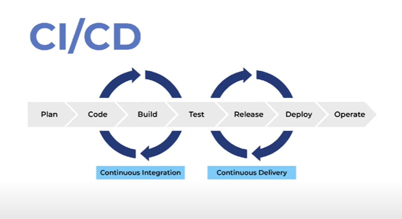


# Infraestrutura como Código (IaC) para Engenheiros de Dados

## 📦 O que é Infraestrutura como Código (IaC)?

IaC é uma abordagem que permite **gerenciar e provisionar a infraestrutura de TI por meio de código**, em vez de configurações manuais em painéis ou consoles. É muito usada por **engenheiros de dados** para criar, escalar e manter ambientes de dados de forma **automática, segura e reprodutível**.

---



## 🚀 Por que isso importa para quem quer ser Engenheiro de Dados?

Como engenheiro de dados, você lida com muitos serviços na nuvem: bancos de dados, clusters Spark, armazenamento em nuvem, etc. Com IaC, você pode:

- Criar ambientes de testes e produção rapidamente.
- Automatizar a criação de pipelines de dados.
- Reduzir erros humanos.
- Ter controle total da estrutura usada nos projetos de dados.

---

## 🛠 Ferramentas comuns de IaC:

### 1. Terraform
- Ferramenta popular para IaC.
- Suporta várias nuvens como AWS, Azure, GCP.
- Usa linguagem declarativa (HCL) para descrever recursos como VMs, redes, buckets, etc.

### 2. AWS CloudFormation
- Específico para a AWS.
- Permite descrever toda sua infraestrutura na nuvem da Amazon via código YAML ou JSON.

### 3. Azure Resource Manager (ARM) / Bicep
- Gerencia recursos no Azure via código.

### 4. Databricks com Terraform
- Permite criar e configurar clusters, workspaces e permissões de forma automática no Databricks.

---

## 🧠 Exemplo simples com Terraform

```hcl
provider "aws" {
  region = "us-east-1"
}

resource "aws_s3_bucket" "meu_bucket_de_dados" {
  bucket = "meus-dados-projeto"
  acl    = "private"
}
```

Esse código cria um bucket S3 na AWS. Você pode rodar `terraform apply` e o recurso é criado automaticamente.

---

## ✅ Benefícios para um engenheiro de dados:

- **Produtividade**: cria ambientes complexos com poucos comandos.
- **Escalabilidade**: facilita a criação de múltiplos ambientes iguais.
- **Segurança**: controla acesso e configurações de forma precisa.
- **Reprodutibilidade**: permite recriar ambientes do zero em poucos minutos.


1. Infraestrutura Como Código com Terraform, AWS, Azure e Databricks

IaC (Infraestrutura Como Código) nasceu no universo DevOps, mas rapidamente chegou à área de dados para ajudar no trabalho de Engenheiros de Dados, Engenheiros de Machine Learning, Arquitetos de Dados, Cientistas de Dados e Engenheiros de IA.

Neste curso você vai desenvolver suas habilidades com Terraform, uma ferramenta open-source que permite definir a infraestrutura como código usando uma linguagem simples e declarativa e implantar e gerenciar essa infraestrutura em uma variedade de provedores de cloud computing (em nuvem pública ou privada) e virtualização, com apenas alguns comandos.

Além do Terraform você vai trabalhar com AWS, Azure e Databricks através de diversos Labs e Projetos. O conhecimento que você irá adquirir neste curso vai colocá-lo muito a frente de outros profissionais do mercado, aumentando de forma considerável sua empregabilidade na área de dados, independente da sua função.